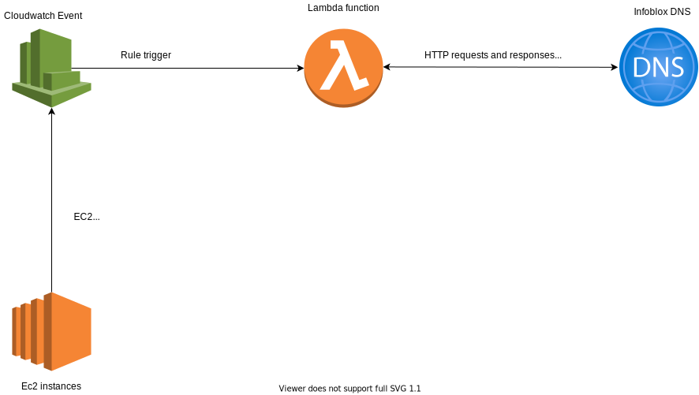
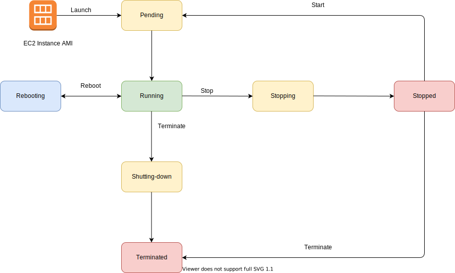

# AWSUpdateReverseDNS

## Purpose
The purpose of this document is to outline the process of updating DNS entries in Infoblox when an EC2 instance is created/deleted. Cloudwatch events are setup to monitor state changes on ec2 instances which trigger a lambda function to interface with infoblox and update the DNS entries. This process helps to keep the DNS information updated in infoblox when a new instance is created or an instance is terminated.

## Overview


## Functionality
### AWS Cloudwatch Events
AWS cloudwatch events help track changes ("events") in AWS services and configure triggers based on these events. An event is not always required by Cloudwatch, triggers can be also scheduled using cron to call AWS services like Lambda, API calls, SNS notifications in a timely manner.


An event is tracked by defining it as a source which tries to match the given definition of the change, the lambda function is called as part of the trigger which is set as target.

References:

* [AWS Cloudwatch Events](https://docs.aws.amazon.com/AmazonCloudWatch/latest/events/WhatIsCloudWatchEvents.html)
* [EC2 State Events](https://docs.aws.amazon.com/AmazonCloudWatch/latest/events/LogEC2InstanceState.html)

### Ec2 State information
An Ec2 instance has 3 Main states (Running, Stopped, Terminated) and 4 intermediate states (Pending, Shutting-down, Stopping, Rebooting)

The following is a high level flowchart showing the mentioned states



In our process we need to capture when an instance is created and terminated.

Instance Creation: The **pending** state event is used since that is the intermediate state which is first called when an instance is launched or started.

Instance Deletion: The **terminated** state event is used since that is the state which is called when an instance has been termination.

### AWS Secret

The api calls require authetication to create or update an entry which is done using a username password combination. The team sets up an aws secret in AWS Secrets Manager and we can get this by using boto3 to access the secrets and retrieve it using the secret id which is provided. The secretID can also be setup as an environment variable.

The following code shows how the secret is fetched from secrets manager:

```python
secretid = '<secretid>'
get_secret_value_response = client.get_secret_value(SecretId=secretid)
secret = get_secret_value_response['SecretString']
secret = json.loads(secret.replace("\'", "\""))
```
### Lambda Function
The lambda function is triggered by cloudwatch events when a rule is matched, and an event message is sent to lambda as input. This event contains the instance details such as instance state, instanceid etc.

We use boto3 client to get information about the ec2 instance, the hostname is taken from the instance-id and appended with <.utdallas.edu> and the IP address is the private IP given to the instance by AWS.

An example hostname and Ip entry would look like hostname: i-0a34ec0412474d0fb.utdallas.edu, ip:10.232.226.119

A pseudo code for the Lambda function is given below:
```
1. Start
2. Capture event JSON message and read Instance ID and state
3. Connect to ec2 client using boto3 and retrieve instance information using Instance ID (Implemented with exception handling)
4. Get private IP address and instance-id from instance
5. Check state, if pending → HTTP request call to infoblox to create entry with hostname and IP
6. Else if, terminated → get IP from infoblox call, then send an HTTP request to infoblox to delete entry with hostname and IP for all record ids returned for the IP.
7. Exit
```
**Permissions:**
The lambda function would need the following policies/access in its role to access resources.
- AWSLambdaVPCAccessExecutionRole (policy)  in order to access EC2 and cloudwatch logs
- GetSecretValue  from SecretsManager (permission) in order to read the secret value for authorization of the http calls to infoblox 

### Infoblox DNS updates

Infoblox entries are created or deleted using http requests. We use urllib3 library from python3 to send these requests.

#### For adding an entry:

We use a POST request with json body which contains hostname and ip.

From python:
```python
headers = urllib3.make_headers(basic_auth=secretid+':'+secret['password'])
headers['content-Type']='application/json'
entry_data = {"name":host, "ipv4addrs":[{"ipv4addr":ip}],"comment":"Created by Lambda API call"}
encoded_data = json.dumps(entry_data).encode('utf-8')
response = http.request('POST', 'https://<hostname>/wapi/v2.10/record:host?_return_fields%2B=name,ipv4addrs&_return_as_object=1',body=encoded_data, headers=headers)
```

From command line using cURL:
```bash
curl -k -u '<secretid>:XXXXXXXX' -H 'content-type:application/json' -X POST 'https://<hostname>/wapi/v2.10/record:host?_return_fields%2B=name,ipv4addrs&_return_as_object=1' -d '{"name":"'${host}'","ipv4addrs":[{"ipv4addr":"'${AWS_IP}'"}]}'
```

Note: Infoblox will reject the entry if an entry already exists with the same hostname and ip address.


#### For deletion:
We first fetch the IP using the instance based hostname from infoblox, then we fetch all the record ids which match the ip address, this gives us all the alias used for that ip.

We then send a DELETE request along with hostname and record id which deletes the unique record for each record id returned.

From python:
```python
r = http.request('GET', 'https://<hostname>/wapi/v2.10/search?address='+ip+'&_return_as_object=1',headers=headers)
x = json.loads(r.data)
for i in x["result"]: # get record id and hostname for each and delete individually
   record = i["_ref"].split('host/')[1].split(':')[0]
   host = i["_ref"].split('host/')[1].split(':')[1].split("/")[0]
   response_instance = http.request('DELETE', 'https://<hostname>/wapi/v2.10/record:host/' + record + ':' + host +'/default?_return_as_object=1', headers=headers)
   print(response_instance.data)
```

From command line using cURL:
```bash
record = curl -s -k -u '<secretid>:XXXXXXXXXXX' GET 'https://<hostname>/wapi/v2.10/search?address=<IP>&_return_as_object=1'
curl -k -u '<secretid>:XXXXXXXXXXX ' -H 'content-type: application/json' -X DELETE "https://nsgrid1/wapi/v2.10/record:host/$record:$host/default?_return_as_object=1
```

